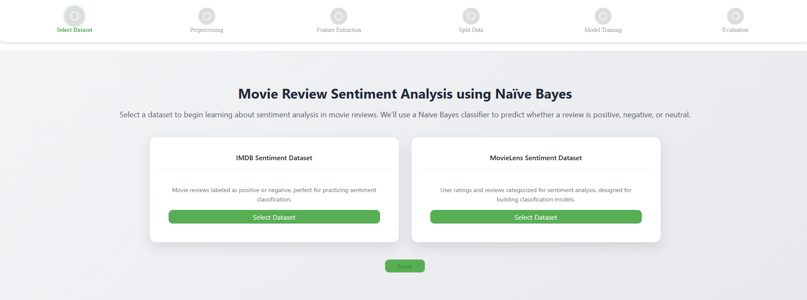
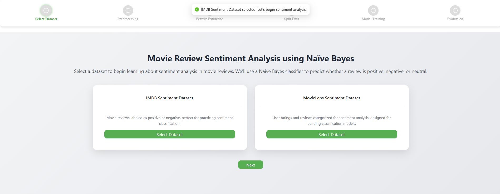
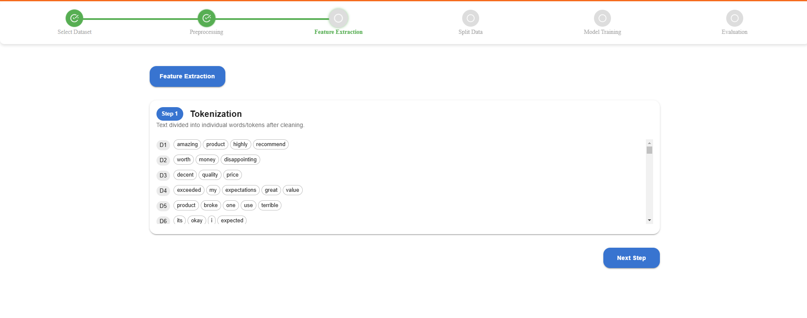
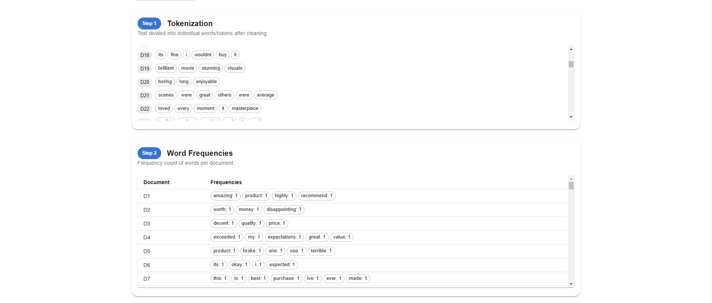
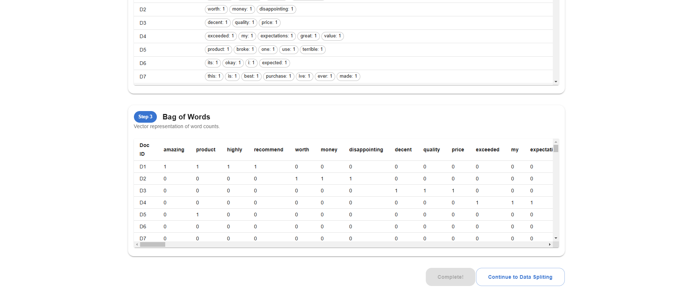
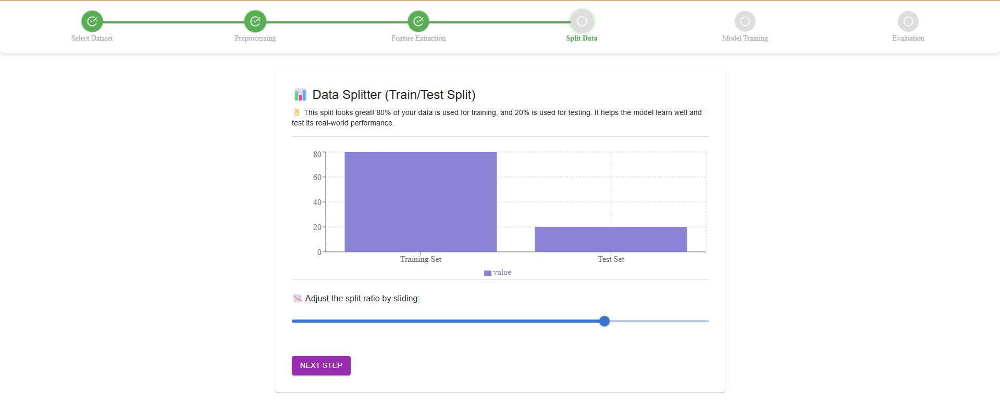
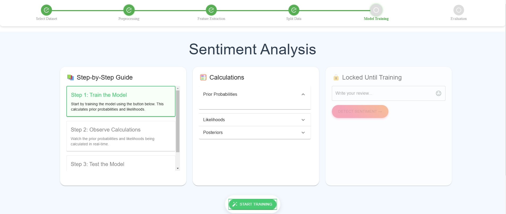
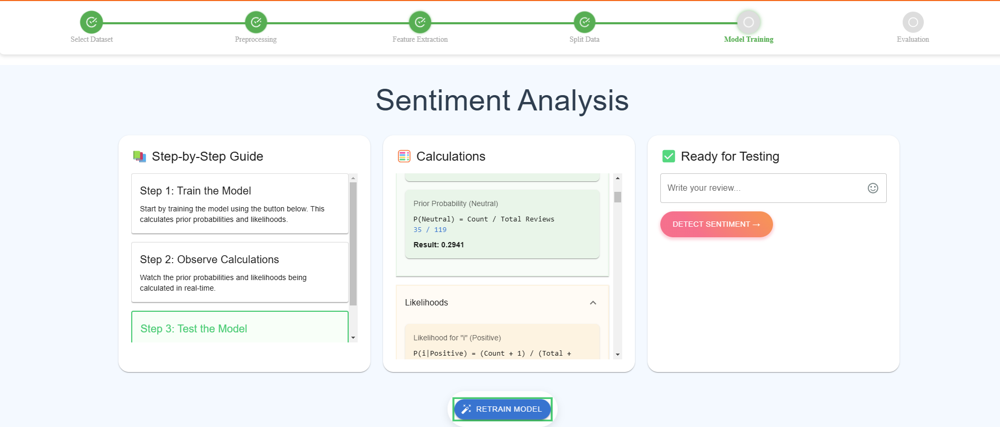
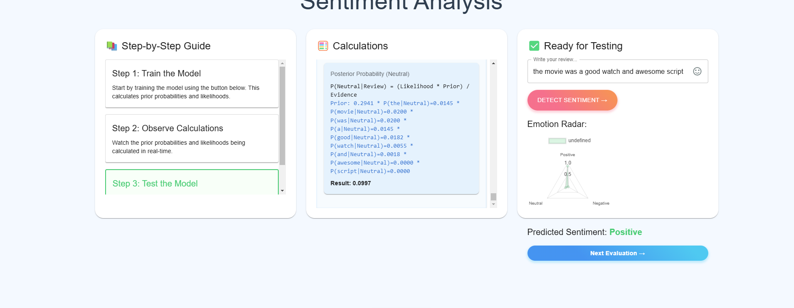
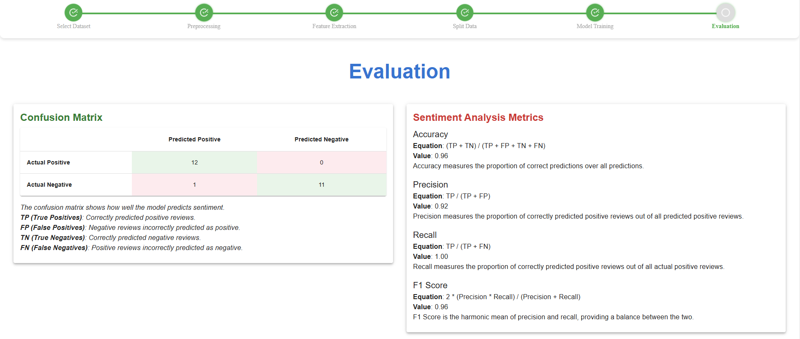

### Procedure
<h5>Step 1: Upload the Dataset</h5>

Start by uploading the movie reviews dataset with sentiment labels. This dataset will be used for training and testing the Naive Bayes classifier.

Click the <strong>Next</strong> button to proceed to the Data Preprocessing step.

<h5>Step 2: Data Preprocessing</h5>

Prepare the text data by applying preprocessing steps like removing stopwords, converting text to lowercase, removing special characters, and tokenization.

Click the <strong>Next</strong> button to iterate through each data cleaning step.

Click the <strong>Proceed</strong> button to move forward to the next step: Feature Engineering.

<h5>Step 3: Feature Engineering</h5>

In this step, the preprocessed text is converted into numerical features for model training. Key techniques include:

<ul>
  <li><strong>Tokenization:</strong> Splitting text into individual words or tokens.</li>
  <li><strong>Word Frequencies:</strong> Counting occurrences of each word in the dataset.</li>
  
  <li><strong>Bag of Words (BoW):</strong> Representing text as a vector of word counts, ignoring grammar and word order.</li>
</ul>

Click the <strong>Proceed</strong> button to move forward to the next step.

<h5>Step 4: Data Splitting</h5>

Split the dataset into training and testing sets to evaluate model performance. A good split ensures the model learns effectively and generalizes well to new data.

<ul>
  <li><strong>Training Set:</strong> Used to train the Naive Bayes classifier.</li>
  <li><strong>Testing Set:</strong> Used to assess model accuracy on unseen data.</li>
</ul>

Adjust the split ratio and observe whether it's a <strong>good split</strong> or a <strong>bad split</strong> based on the description.

Click the <strong>Proceed</strong> button to move forward to the next step.

<h5>Step 5: Training the Model</h5>

Train the Naive Bayes classifier using the prepared training dataset. The model learns patterns from the features extracted in the previous steps.

<ul>
  <li><strong>Probability Calculation:</strong> The classifier computes the probability of a review being positive or negative based on word occurrences.</li>
  <li><strong>Bayes' Theorem:</strong> It applies Bayes’ Theorem to update probabilities as new data is introduced.</li>
</ul>

Click the <strong>Start Training</strong> button to train the model.

Observe the probability and likelihood calculations happening in real time as the Naive Bayes classifier learns from the data.

Enter a movie review and click the <strong>Detect</strong> button.
  

Observe the posterior probability calculations in real time, along with the prediction graph and final sentiment classification result.

Click the <strong>Evaluation</strong> button to move forward with the process.

<h5>Step 6: Model Evaluation</h5>

Evaluate the performance of the trained Naive Bayes classifier using key metrics.
  
<ul>  
  <li><strong>Accuracy:</strong> Measures the percentage of correctly classified reviews.</li>  
  <li><strong>Precision:</strong> Indicates how many of the predicted positive reviews are actually positive.</li>  
  <li><strong>Recall:</strong> Measures how well the model identifies all actual positive reviews.</li>  
  <li><strong>F1-Score:</strong> A balance between precision and recall for overall model performance.</li>  
</ul>  

